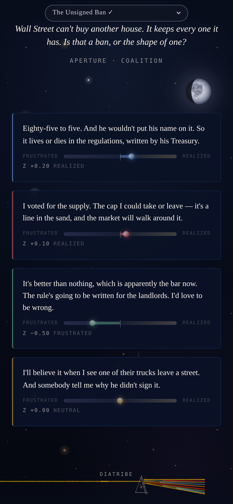
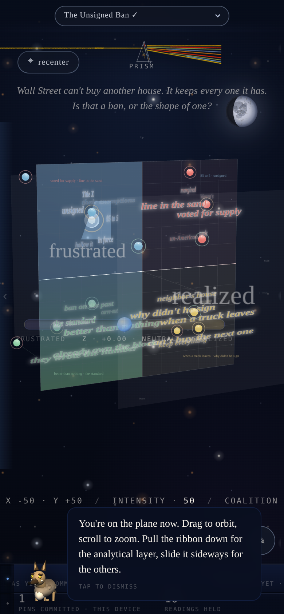
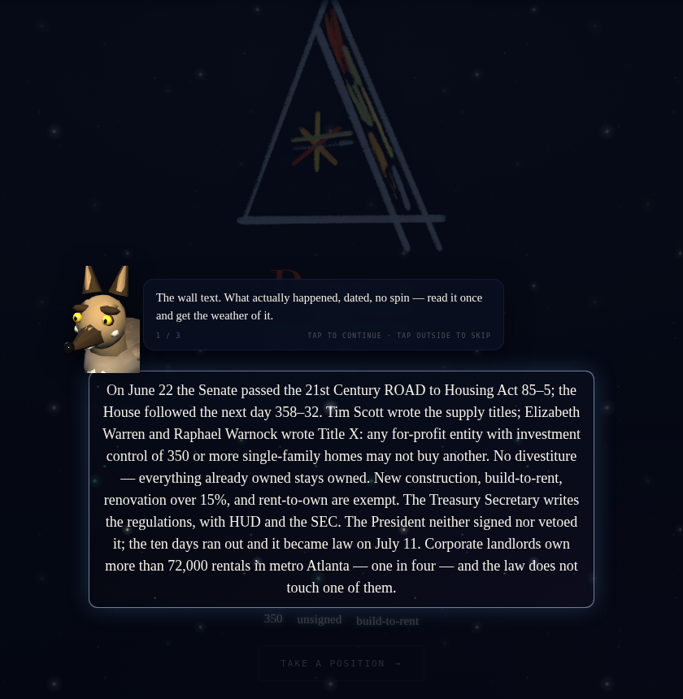

# Prism

**→ Open it: https://sailor7613.github.io/Prism/** — it runs in the browser, nothing to install. Best on a phone.

Prism is a way of seeing your own politics. It takes one real thing that happened — a law that
passed, an order that was signed, a ruling that landed — and lets you find where you actually stand
on it, in three dimensions: *which side*, *how hard you hold it*, and *whether you believe the thing
delivers*. Then it shows you the room: the twelve stations a Reading was authored from, and the pins
of everyone else who has stood on that plane.

One way to say it: a Bloomberg terminal for legislative politics — except the instrument is you.

<p align="center">
  
  &nbsp;&nbsp;
  
</p>

## How to read a Reading (about three minutes)

1. **The framing.** The wall text: what happened, dated, no spin. Ted the coyote will walk you through the first time.
2. **The Diatribe.** Drag the rail to set your *aperture* — how much this thing grabs you. Outer third: you disagree but you're arguing about the same thing. Middle: it's teams. Inner: you're arguing about what the thing even *is*.
3. **The four responses.** One per corner of the plane, at the aperture you chose, each with the author's call on whether it *delivers* (the small rail: frustrated ← → realized). Pick the one you'd actually say.
4. **Place your pin.** Where you sit in that corner, how hard, and your own call on delivery — the third axis.
5. **The plane.** Your pin among the twelve stations, floating at their authored depth; hold one to read it against yours. Pull the ribbon down for the room. The strip at the bottom is **Burns** — where your pin and the Reading's stations disagree, and every object the newsroom is watching.

<p align="center"></p>

## Where it is (September 2026)

Live now: ten authored Readings (housing, tariffs, the dividend, the refund, the NDAA, birthright citizenship and others), the three-axis instrument, the twelve-station plane, Ted's tour, Burns.

Landing this week: a **newsroom** that scans the wire every three hours for *objects* — instruments that finished forming — keeps a register of what the discourse does to them (goes dark, comes back renamed, flips sides), and drafts new Readings from it daily; **profiles** for the beta group, so your pins are public under your name and the plane shows the room; the residents' avatars on the plane.

It is a closed beta and a work in progress; the seams show in places. The concept is the thing to look at.

---

*Everything below is for people working on the code.*

## Layout

The repo is organized by **lifecycle**: where a file comes from and
who consumes it.

```
Prism/
├── index.html            Launcher page (links to portal + admin).
├── v2/index.html         Main app entry — the live portal.
├── admin-surface.html    Admin instrument (current).
├── admin.html            Legacy admin desk (being retired).
├── README.md             (this file)
│
├── src/                  Source you write by hand.
│   ├── css/              Stylesheets.
│   └── js/               Runtime JS modules used by the HTML entries.
│
├── data/                 Pipeline output. Consumed by the app at
│                         runtime. Regenerated by `scripts/`.
│
├── scripts/              The pipeline itself. Fetches from
│                         Congress.gov + voteview.com, writes to
│                         `data/`.
│
├── test/                 Standalone test harnesses (HTML pages
│                         that exercise individual modules).
│
├── parallelograms/       Case studies and conceptual docs about
│                         specific bills / political dynamics.
│
└── archive/              Superseded code kept for reference.
                          Not loaded by anything.
```

## How to view the app

It's a static page. Open `v2/index.html` in a browser. Most modern
browsers will let you double-click the file. If anything fails to
load due to CORS on `file://`, run a one-liner local server from
the Prism root:

```
python3 -m http.server 8000
# then visit http://localhost:8000/v2/index.html
```

## How to rebuild the data

The fetchers live in `scripts/` and need a Congress.gov API key.

```
export CONGRESS_API_KEY=your_key_here
cd scripts
node run-all.js
```

This writes the latest member and bill data straight into `../data/`,
which the HTML entries read on load. A full run takes a few minutes
because the script paces API calls deliberately to stay under the
rate limit.

To fetch only one slice:

```
node fetch-members.js   # members + voteview ideology scores
node fetch-bills.js     # bill metadata + actions
```

## Where things live

| If you want to… | Look in… |
| --- | --- |
| Change how the graph renders | `src/js/prism-graphmap.js` |
| Change the database / lookup layer | `src/js/prismdb.js` |
| Adjust the splash screen | `src/js/prism-splash.js` |
| Adjust the parallax / hero | `src/js/prism-parallax.js` |
| Restyle | `src/css/prism-styles.css`, `src/css/prism-desktop.css` |
| See what the pipeline produced | `data/` |
| Modify how the pipeline runs | `scripts/` |
| Read a case study | `parallelograms/case_studies/` |

## Notes on `archive/`

Three files live here. They're inactive — nothing in `src/` or any
HTML imports them.

- `fetch_members.js` — the original single-file fetcher.
  Superseded by `scripts/run-all.js` + `scripts/fetch-members.js`.
- `prismdb_members_extension.js`, `refraction_member_browser.js` —
  patch-style notes from an earlier merge. Their content was
  rolled into `src/js/prismdb.js` and the (since retired)
  `index-v56.html`. Kept here as a paper trail, not loaded.
- `index-v56_2026-07-07_retired-superseded-by-v2.html` — the
  pre-rebuild portal, retired from the repo root 2026-07-07 so it
  can't be mistaken for the live entry (`v2/index.html`).
